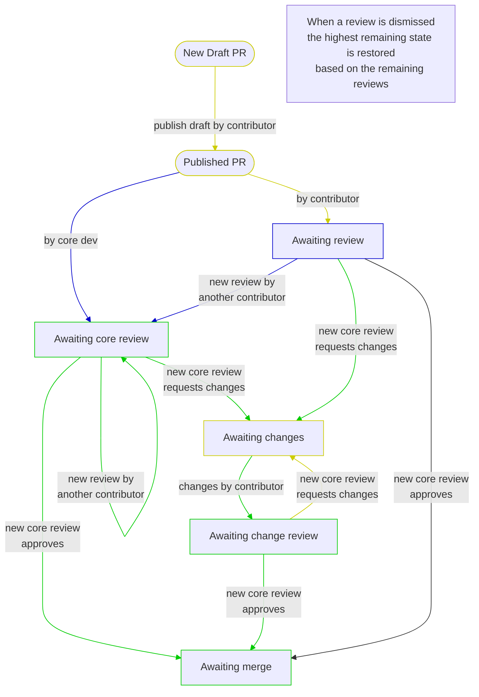

# bedevere

This bot is meant to help identify issues with a CPython pull request.

## What the bot does:
- ### Identifies missing GitHub issue numbers in the title
If no GitHub issue number is found the status fails and the
"Details" link points to the relevant
[section of the devguide](https://devguide.python.org/getting-started/pull-request-lifecycle.html#submitting).
- ### Links to GitHub issues
If an issue number is found then the "Details" link points to the relevant issue
itself, making it easier to navigate from PR to issue.
- ### Identifies missing news entry
If no `Misc/NEWS.d` entry is found or the news entry is formatted incorrectly
and the issue doesn't have the `skip news` label, the status fails and a relevant
description label is added to it.
- ### Closes invalid PRs
Closes PRs that try to merge a maintenance branch into the main branch, adds
`invalid` label, and posts a relevant message.
- ### Labels PRs for docs
Labels PRs for documentation as `type-documentation`
- ### Copies main labels to backport
Copies labels from main PRs to backport PRs

## PR State Machine

This diagram represent the state machine for pull requests, and the labels
applied by Bedevere.

The colors represent who can make a state change or who is currently
blocking the PR from moving forward:
* Yellow: the PR creator
* Green: core developers
* Blue: anyone

<!--
  Changes to the labels in this flowchart should be reflected
  in the devguide: https://devguide.python.org/triage/labels/
-->

## *Aside*: where does the name come from?
Since this bot is about identifying pull requests that need changes,
it seemed fitting to name it after Sir Bedevere who knew
[how to identify a witch](https://youtu.be/yp_l5ntikaU).
